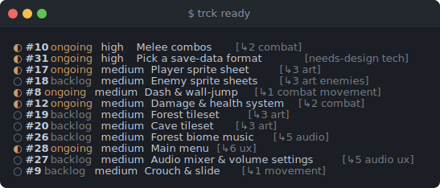
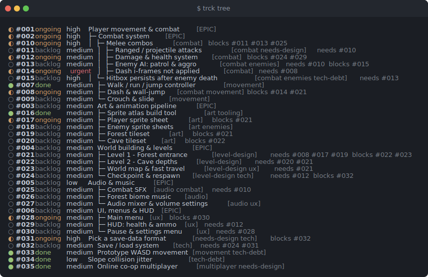
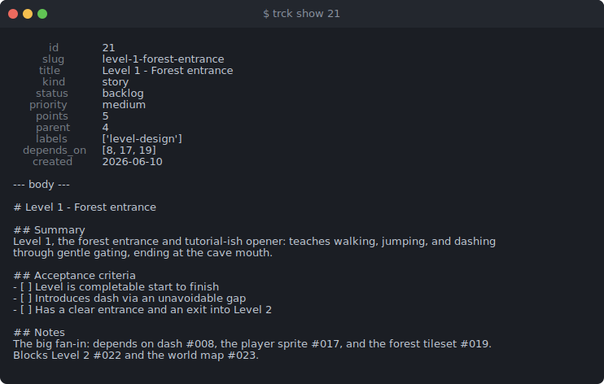
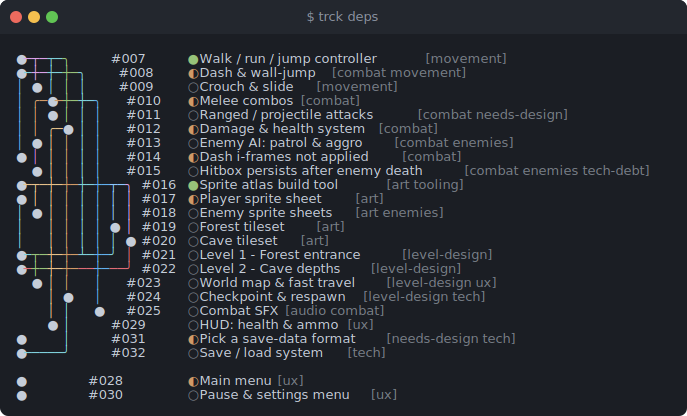

# trck

A deterministic, single-file, **standard-library-only** issue tracker that lives *inside*
your repo. Status is the folder a markdown file sits in; all other metadata lives in
`index.jsonl`; `SUMMARY.md` is generated; only issue *bodies* are hand-authored — so the
tracker can't drift. `trck` is the generalized successor to the original `track` script.

- **One file, zero dependencies.** Just Python 3. Vendor it into a repo and commit it, or
  install it once on your `PATH`.
- **Git-friendly & agent-friendly.** Plain text, line-oriented `index.jsonl`, generated
  `SUMMARY.md`, and a hand-edited markdown body per issue.
- **Vocabulary-agnostic.** Statuses, priorities, kinds, resolutions, and verb aliases are
  configurable per repo; sensible defaults work with zero config.

<p align="center">
  <br>
  <sub><code>trck ready</code> against the bundled <a href="examples/">example tracker</a></sub>
</p>

## Install (global)

```bash
curl -fsSL https://raw.githubusercontent.com/leonkacowicz/trck/main/trck \
  -o ~/.local/bin/trck && chmod +x ~/.local/bin/trck
```

Then, in any repo:

```bash
trck init                       # scaffold ./issues (config + a vendored copy of trck)
                                # `trck init <dir>` for a custom dir; `--no-vendor` skips the engine copy
trck new "Fix login bug" --priority high
trck start 1                    # move to the configured 'start' status (default: ongoing)
trck done 1 --resolution wontfix
trck list                       # nested forest: every issue, children under their parent
trck list --flat                # flat, globally-sorted list
trck tree 1                     # alias for `list 1`: root the forest at one issue's subtree
```

`trck` finds its tracker by walking up from your current directory to the folder containing
`trck.json`, so it works from anywhere in the repo. Override with `--dir PATH` or `$TRCK_DIR`.

## Vendored / CI use

`trck init` drops a committed copy at `issues/trck`. CI and auditing use that copy with no
global install:

```bash
./issues/trck check          # nonzero exit if the tracker is inconsistent
```

## Self-update

```bash
trck update            # pull the latest stable release and atomically replace the running file
trck update --check    # report what's available, write nothing
trck update --ref v0.3.0   # update to a specific tag/branch
```

The download is validated (`compile()` + a sanity check) before the file is atomically
replaced; a failed update leaves your current `trck` untouched. Commit the resulting change to
the vendored copy like any other diff.

## Configuration (`issues/trck.json`)

Zero config works out of the box. To customize, edit `trck.json`:

```json
{
  "update":      { "repo": "leonkacowicz/trck", "channel": "stable" },
  "statuses":    [ {"name": "backlog", "role": "initial"},
                   {"name": "ongoing", "role": "active"},
                   {"name": "done",    "role": "terminal"} ],
  "aliases":     { "start": "ongoing", "done": "done" },
  "priorities":  ["urgent", "high", "medium", "low", "lowest"],
  "default_priority": "medium",
  "kinds":       ["task", "epic", "bug", "story", "investigation"],
  "resolutions": ["superseded", "wontfix", "duplicate"]
}
```

Statuses are an **ordered, free-form list**; the folders are named after them and `SUMMARY.md`
groups by that order. Semantics attach to **roles**, not names. Exactly one status must carry
each of the three roles (extra unroled statuses — e.g. a `review` lane — are fine):

- `initial` — where `trck new` lands an issue (and the first move off it stamps `started`).
- `active` — the "in progress" status a parent rolls up to (see below).
- `terminal` — entering it stamps `closed` and permits a `--resolution`; leaving it (reopen)
  clears both. "Didn't really finish" outcomes (wontfix/duplicate/…) are a `--resolution`,
  not a separate status.

A **parent's status is derived from its children**: all `initial` → `initial`, all `terminal`
→ `terminal`, otherwise `active`. This rollup is maintained automatically on every move,
recursively up to the root. To override it, `mv` the parent by hand — that pins its status;
`set NNN --auto` returns it to derivation.

The generic `trck mv NNN <status>` moves between any statuses; `start`/`done` are convenience
aliases resolved through `aliases`. So a repo can use, say, `todo → doing → review → shipped`
and either define its own aliases or just use `mv`.

`priorities` is **ordered by precedence** — first is highest — and that order drives
`list --sort priority`, `ready`, and `next`. The priority `trck new` assigns when you don't
pass `--priority` is set separately by `default_priority` (default `medium`); if omitted it
falls back to the middle of the list.

## Common verbs

`new` · `mv` · `start` · `done` · `set` · `dep` · `label` · `show` · `list` · `ready` ·
`next` · `tree` · `deps` · `path` · `which` · `check` · `summary` · `normalize` ·
`install-hook` · `init` · `update` · `version`. Run `trck --help` (or `trck <verb> --help`) for details.

`list` is the structure-aware browse verb. By default it prints a **nested forest** — every
issue, with children nested under their parent and siblings ordered by `--sort` (default id).
`--flat` gives a flat, globally-sorted list instead; a positional id (`trck list 4`) roots the
forest at that issue's subtree. Filters (`--status`, `--kind`, `--priority`, `--label`,
`--match`, `--parent`, `--blocked`, `--orphan`) select the matches and the forest fills in
their **ancestor spine** as dimmed context, so a matched child never floats away from its
parent. `tree` is an alias for `list` (`trck tree 4` == `trck list 4`).

<p align="center">
  <br>
  <sub><code>trck tree</code> — the whole forest, children nested under their parent</sub>
</p>

`ready` lists issues whose dependencies are all satisfied (add `--next` for just the top
pick); `next` prints the single best issue to work on next; `normalize` rewrites
`index.jsonl` in canonical slim form.

Epics: create an epic with `--kind epic`, attach children with `--parent NNN`; the epic's
points-weighted rollup `%` is computed from its children and shown after the title on every
parent row in `trck list`/`tree` (leaf rows carry none) as well as in `SUMMARY.md`. (Any
issue can be a parent — `kind: epic` is just a display label.) Filter a list to one epic's
children with `trck list --parent NNN`.

Labels: tag issues with a flat, multi-valued set of free-text labels via
`trck label NNN --add X --remove Y`, then filter with `trck list --label X`. Labels show
up in `show`, `list`, `tree`, and `SUMMARY.md`.

**Custom fields** — attach arbitrary `key=value` metadata that trck doesn't model itself:
`assignee`, `reporter`, `component`, `area` — whatever a project needs. They're **free-form**
(no `trck.json` declaration) and always string-valued, so they stay out of the core mental
model until you reach for them. Set them on `set`, then **filter**, **sort**, and **show**
them on `list`:

    trck set 42 --field assignee=leon --field component=engine   # set (repeatable)
    trck set 42 --field assignee=                                 # clear (same as --unset assignee)
    trck list --field component=engine                           # filter: exact, AND-ed, composes with --status etc.
    trck list --field component=engine --sort field:assignee     # sort by a field (rows missing it sort last)
    trck list --show-field assignee --show-field component        # opt-in trailing columns

Keys must be slug-like (`[a-z][a-z0-9_-]*`) and can't shadow a built-in field. Values always
appear in `trck show`; `list` stays clean unless you ask for a `--show-field` column. `check`
flags any malformed key or non-string value. Free-form by design — a future opt-in schema
(types, allowed values, required-ness) is sketched in
`docs/specs/2026-06-11-custom-fields-design.md`.

Full-text body search: `trck` has no built-in `search`/`grep` verb — issue bodies are plain
Markdown files, so it composes with the search tool you already have. `trck list --paths`
prints the absolute file path of each issue passing the usual filters, `trck path NNN` prints
one issue's path, and `trck which` maps issue file paths (positional args, or one per line on
stdin) back to `list`-style rows (`--ids` for bare ids). Together they scope, search, and
render:

    rg -l 'race condition' $(trck list --paths --status '!done')   # paths, scoped by metadata
    rg -l 'race condition' $(trck list --paths) | trck which       # ...rendered back as issues
    trck path 25                                                   # one issue's file, e.g. to $EDITOR

Output is colorized when stdout is a terminal (disable with `NO_COLOR=1`, force with
`FORCE_COLOR=1`); piped/redirected output stays plain for scripts and agents. `trck show`
prints a human-readable summary by default — add `--json` for machine-readable metadata.

<p align="center">
  <br>
  <sub><code>trck show 21</code> — one issue's metadata above its hand-authored body</sub>
</p>

## Recommended usage

trck gives you four ways to relate issues — **parent/child**, **labels**, **dependencies**,
and **priorities**. They mean different things; using the right one keeps the tracker honest.

### Parent / child = decomposition, not categorization

Make one issue the **child** of another only when the children are a genuine **break-down of
the parent into sub-tasks** — the parent *is* the sum of its children.

- A parent is **not** a generic bucket of similar tasks. For grouping similar work, use
  **labels** instead.
- A parent should be a **single, clear, achievable goal** that you split into the steps
  needed to reach it.
- **Litmus test:** the parent can be marked *done* exactly when all its children are done. If
  finishing the children wouldn't justify closing the parent, it isn't a parent — it's a label.

### Dependencies = hard ordering (MUST)

A **dependency** encodes that one task *must* be completed before another can be:
`A depends on B` means **B blocks A**. It's a real constraint — `trck ready` and `trck next`
will not surface a task until its dependencies are satisfied. `trck list` makes the graph
visible inline: each row carries a dim `needs #NNN` for every open (non-terminal) blocker and
`blocks #NNN` for the issues waiting on it; both clear automatically once the blocker is done.
`trck deps` draws the dependency DAG as a lazygit-style gutter, topologically sorted so a
blocker always sits above what it blocks — the whole graph with no id, or `trck deps NNN`
for just that issue's directed dependency line (its transitive prerequisites and
dependents), where the focal issue's row is marked with a `▸` and bolded. Scope to one
cone with `trck deps NNN --requires` (only what it needs) or
`--blocks` (only what waits on it); add `--full` instead to widen to the issue's whole
connected cluster, including cousins joined only through a shared neighbour.

<p align="center">
  <br>
  <sub><code>trck deps</code> — the dependency DAG, each lane traced in its own colour</sub>
</p>

### Priorities = soft ordering (SHOULD)

A **priority** expresses that a task *should* be done before another — an ordering
preference, not a constraint. Nothing is blocked; it just influences what to pick up next.

> Rule of thumb: decomposition → **parent/child**; "a category of similar things" →
> **labels**; "must come first" → **dependency**; "ought to come first" → **priority**.

## Develop

```bash
python3 -m unittest discover -s tests -v
```

The engine is the single file `./trck` (executable, and importable for tests). Keep it
standard-library only. This repo **self-hosts** its own issues under `./issues/` — browse them
to see `trck` tracking its own roadmap.

The README screenshots are regenerated (also standard-library only) from the bundled example
tracker with `python3 docs/gen-screenshots.py`, which writes the SVGs under `docs/img/`.

Releasing: bump `__version__` in `trck`, commit, tag `vX.Y.Z`, and create a GitHub Release —
that release is the stable channel `trck update` consumes.
