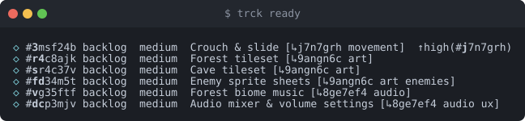
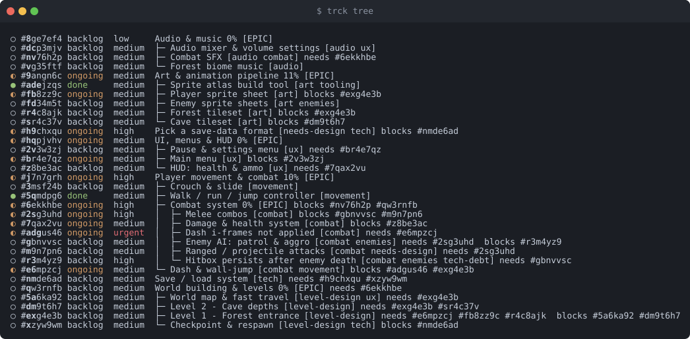
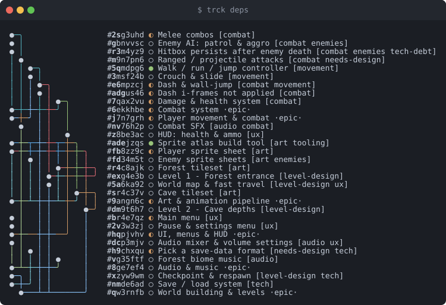

# trck

A deterministic issue tracker that lives *inside* your repo. Every issue is a markdown file
in `items/`; all metadata — status included — lives in `index.jsonl`; `SUMMARY.md` is
generated; only issue *bodies* are hand-authored — so the tracker can't drift.

- **One binary, zero dependencies.** Nothing to install alongside it, no runtime, no
  package tree — a single executable your repo can depend on for years.
- **Git-friendly & agent-friendly.** Plain text, line-oriented `index.jsonl`, generated
  `SUMMARY.md`, and a hand-edited markdown body per issue. Merge drivers resolve concurrent
  edits row by row instead of leaving conflict markers in your metadata.
- **Zero configuration.** The vocabulary is fixed — four statuses, five priorities, three
  resolutions — so every tracker means the same thing. Anything finer is a label or a
  custom field.

<p align="center">
  <br>
  <sub><code>trck ready</code> against the bundled <a href="examples/">example tracker</a></sub>
</p>

## Install

```bash
curl -fsSL https://raw.githubusercontent.com/leonkacowicz/trck/main/scripts/install.sh | sh
```

The script picks the right build from `uname`, verifies the published checksum, and installs
to the first writable directory it finds (`~/.local/bin`, `/usr/local/bin`, `~/bin`).
`TRCK_BIN_DIR` overrides where it lands and `TRCK_VERSION` pins which release to fetch.

Prebuilt for Linux (glibc and musl), macOS and Windows, on x86-64 and arm64 — every release
attaches the archives and their `.sha256` files, so downloading one by hand and putting it on
your `PATH` works just as well. There is a Homebrew formula under `packaging/homebrew/`.

On Windows, run the script from Git Bash, or download the `.zip` from the
[latest release](https://github.com/leonkacowicz/trck/releases/latest), extract `trck.exe`,
and add its folder to `PATH`.

Then, in any repo:

```bash
trck init                       # scaffold ./issues (config + the docs that explain it)
                                # `trck init <dir>` puts it somewhere else
trck new "Fix login bug" --priority high   # prints the new issue's file path
trck start k3m                  # any unambiguous prefix works (git-style)
trck review k3m https://github.com/you/repo/pull/12   # -> in-review, and links the PR
trck done k3m9x2a --resolution wontfix
trck list                       # nested forest of active work (settled subtrees hidden)
trck list --all                 # include settled (done) work too
trck list --flat                # flat, globally-sorted list
trck tree k3m                   # alias for `list k3m`: root the forest at one issue's subtree
```

`trck` finds its tracker by walking up from your current directory to the folder containing
`trck.json`, so it works from anywhere in the repo. Override with `--dir PATH` or `$TRCK_DIR`.

## Keeping a tracker honest

```bash
trck check          # nonzero exit if the tracker is inconsistent
```

That is the command worth wiring into CI: it catches an index row with no body file, a
dangling parent, a dependency cycle — anything that would make the tracker disagree with
itself. Install a step that runs it on every push, pinned to a version so your build does
not change behaviour because a release happened overnight.

Locally, `trck repo install-hook` adds a pre-commit hook that runs the same check whenever a
commit touches the tracker. Treat it as a convenience rather than a guarantee: a hook is one
`--no-verify` away from silent, and it does nothing at all on a machine that has no `trck`.

## Upgrading

Whatever installed `trck` owns the file: re-run the install script, or use your package
manager. There is deliberately no self-update — a binary that rewrites itself while a package
manager believes it owns that path is a worse problem than the one it solves. `trck version`
reports what you have, and there is no `update` verb: typing one gets an error naming the
upgrade path instead.

## Vocabulary

The vocabulary is **fixed** — not configured, not renameable, not extensible. These are
decisions worth making once rather than per repo, and fixing them is what lets any tool
reading a tracker know what it is looking at without first reading a config file.

### Statuses

    backlog  →  ongoing  →  in-review  →  done

| status | means | to the engine |
|---|---|---|
| `backlog` | not started | where `trck new` lands an issue; the first move off it stamps `started` |
| `ongoing` | someone is on it | what a partly-finished parent rolls up to |
| `in-review` | in flight, output pending someone else's judgement | nothing to pick up, so `ready`/`next` skip it — but it still **blocks** its dependents |
| `done` | finished | satisfies a dependency; counts toward progress. Entering it stamps `closed`; leaving it (reopen) clears that and any resolution |

Status is stored in `index.jsonl` and nowhere else — moving an issue rewrites one index line
and leaves its body file where it is.

`in-review` is the one that needs a rule, because it looks like it overlaps `depends_on`:

- **`depends_on`** when the blocker is real work someone will do and close.
- **`in-review`** when making it a task would be inventing one.

A code review forces the distinction: the reviewer isn't producing a deliverable, they're
judging yours, so a task for it would be a fiction — and one per reviewable issue would
double the tracker. Same for a vendor reply or a sign-off nobody here will ever close.

A **parent's status is derived from its children**: all `backlog` → `backlog`, all `done` →
`done`, otherwise `ongoing`. The rollup is maintained on every move, recursively up to the
root. To override it, `mv` the parent by hand — that pins its status; `set NNN --auto`
returns it to derivation.

`trck mv NNN <status>` moves between any two; `start` / `review` / `done` are aliases for the
three you reach for.

### Priorities

    urgent  >  high  >  medium  >  low  >  lowest

Ordered by precedence, and that order drives `list --sort priority` as well as the demand
ranking behind `ready` and `next` (which weighs what an issue *unblocks*, not only what it
declares — see **Ranked by demand** under [Common verbs](#common-verbs)). `trck new` assigns
`medium` when you don't pass `--priority`.

### Resolutions

    superseded  ·  wontfix  ·  duplicate

Valid only on `done`, and they all mean **closed without shipping**: a later issue took over,
nobody will do it, or it's already tracked elsewhere. The normal case is to carry *none* —
"finished, it went out" — and that absence is load-bearing: `trck changelog` lists issues
closed in a window **without** a resolution, so there is deliberately no `fixed`.

### Anything finer

A distinction the four statuses don't draw — `qa` versus `awaiting-deploy`, a bug/story
split, a team — is a **label** (multi-valued, free text) or a **custom field** (one value per
key). Both filter and sort, so a second status vocabulary would only overlap them.

## Configuration (`issues/trck.json`)

With the vocabulary fixed, `trck.json` holds the format version and the update channel. It
exists mainly to mark the tracker's root:

```json
{
  "format": 1,
  "update": { "repo": "leonkacowicz/trck", "channel": "stable" }
}
```

The `update` block only records where the binary came from — no verb acts on it, since
upgrading is the job of whatever installed the file.

A tracker still carrying the old vocabulary keys is not broken: they're ignored, and `check`
names each one.

### Format version

`format` says which shape the tracker is written in. An engine **refuses a tracker newer than
it understands** — every verb goes through one guard, so there is no path that reads or writes
a layout it can only half-parse. It never refuses an *older* one; that is what the migration
verbs are for. Omitting the key means "the current shape", so every tracker written before this
existed keeps working. The refusal names the remedy — upgrade the binary — since the engine
has no way to migrate a shape it was written before.

Bumps are rare, because the test is whether an older engine would be **wrong**, not merely
ignorant:

| change | bump? |
|---|---|
| a new field in `index.jsonl` | **no** — unknown keys round-trip verbatim, so an old engine preserves it |
| a new verb, flag, or column | **no** |
| an existing field changing meaning, or data moving | **yes** — an old engine gives wrong answers or destroys data |
| an opt-in feature only some trackers use | **neither** — that is an extension |

Extensions are git's model, taken for its granularity. A flat version pins the whole tracker,
so bumping it for an opt-in feature would lock out old engines for every repo, including the
ones not using it:

```json
{ "format": 1, "extensions": { "some-feature": {} } }
```

The version means "you may meet extension keys — refuse any you do not know", so only the
repos that opted in are affected. No extensions are defined yet.

One honest limit: this protects engines from the release that introduced it onward. An engine
predating it ignores both keys and can still be fooled, so the guard is a floor rather than a
guarantee — keep everyone reading a shared tracker on a version that has it.

### Pinning the clock

`TRCK_NOW` fixes the timestamp a command stamps into `created`/`started`/`closed`:

```bash
TRCK_NOW=2026-01-01T00:00:00Z trck new "Reproducible"
```

It's read per invocation, so a script can advance it between commands. Any ISO-8601
instant is accepted and normalised to UTC; a malformed or day-only value is an error
rather than a silent fall back to the real clock. This exists so the conformance suite
can compare `index.jsonl` byte for byte — it is part of the specification, not a test hook
bolted onto one implementation.

### Machine-readable output (`--json`)

`list`, `show`, `deps`, `ready` and `next` take `--json`. Every one emits **exactly one
JSON document** — `json.loads(stdout)` is always the way to consume it — and issue objects
are the same shape everywhere: every stored field, `null` where unset, ids never abbreviated.

```bash
trck list --json                  # nested forest: each node + a "children" array
trck list --flat --json           # flat array, in the sorted order
trck show NNN --json              # the metadata plus a "body" field
trck deps NNN --json              # {"requires": [...], "blocks": [...]}
trck next --json                  # array of one, ranked
```

Two shape notes worth knowing:

- **`list --json` marks context rows.** The forest pulls non-matching ancestors in so a
  matched child never floats free; the human view dims them, and the JSON sets
  `"context": true`. Without it you can't tell a result from the scaffolding.
- **`ready`/`next --json` carry the demand note as data.** A row lifted above its own
  priority gets `demand_priority` and `demand_source` — what the human view renders as
  `↑urgent(#a1b2c3)` — omitted on rows that aren't lifted. **The array order is the
  contract**: this verb's whole answer is "in what order", so you never re-derive it.

An empty result is `[]`, not silence.

## Issue ids

Each issue gets a **short random alphanumeric id** — 7 characters drawn from a base32
alphabet with look-alike characters (`0/1/o/l/i`) removed, e.g. `k3m9x2a`. Random ids
make concurrent `trck new` on two branches collision-free (the old sequential scheme
caused merge conflicts).

Wherever a command takes an id, **any unambiguous prefix works** (git-short-hash style):
`trck show k3m` resolves to `k3m9x2a` as long as no other id starts with `k3m`. An
ambiguous prefix is an error that lists all matching candidates.

### Supplying an id

`trck new --id k3m9x2a` uses the id you give instead of minting one. It's for moving issues
in from another tracker with their ids intact, restoring one deleted by hand, and scripted
seeding — the id must be unused (in the index *and* on disk) and well formed, so it can't
reintroduce the collisions random ids exist to prevent.

There's no equivalent on `set`: changing an existing issue's id would have to rewrite every
`parent`/`depends_on` pointing at it and rename its body file.

## Common verbs

`new` · `mv` · `start` · `review` · `done` · `set` · `dep` · `label` · `show` · `list` · `ready` ·
`next` · `tree` · `deps` · `path` · `which` · `changelog` · `diff` · `check` · `summary` ·
`html` · `init` · `version`, plus `repo normalize` · `repo install-hook` · `repo setup-git` ·
`repo migrate-layout` for tracker maintenance. Run `trck --help` (or `trck <verb> --help`)
for details.

`list` is the structure-aware browse verb. By default it prints a **nested forest** — each
issue, with children nested under their parent and siblings ordered by `--sort` (default `created`).
By default it also **hides settled work**: a terminal (done) issue is shown only while it is
still open or sits directly under a non-terminal parent — so an open epic keeps its done
children as progress context, but a fully-done subtree and standalone done tasks drop off.
`--all` shows everything; an explicit `--status` bypasses the prune (e.g. `--status done`
lists every done issue). `--flat` gives a flat, globally-sorted list instead; a positional id
(`trck list 4`) roots the forest at that issue's subtree. Filters (`--status`, `--priority`,
`--label`, `--field`, `--match`, `--parent`, `--blocked`, `--orphan`) select the matches and
the forest fills in their **ancestor spine** as dimmed context, so a matched child never floats
away from its parent. `tree` is an alias for `list` (`trck tree 4` == `trck list 4`).

<p align="center">
  <br>
  <sub><code>trck tree</code> — the active forest; done items show as context under open epics (settled subtrees are hidden; <code>--all</code> shows them)</sub>
</p>

`ready` lists issues whose dependencies are all satisfied (add `--next` for just the top
pick); `next` prints the single best issue to work on next. Both take an optional issue id —
`trck ready NNN` scopes to that issue's subtree, answering "what can I pick up on this epic
right now".
Scoping narrows the answer, never the constraints: a leaf waiting on something outside the
subtree, directly or through an edge authored on an ancestor, stays out of the list — and
never the ranking either: rows are ranked over the whole graph, then filtered.

**Ranked by demand.** `ready`/`next` don't order by an issue's own priority alone — a
medium task standing between you and an urgent one matters more than a high one that
blocks nothing. Each issue is ranked by its **demand cone**: itself plus every unfinished
issue transitively waiting on it, through both authored dependencies (a dependent needs
it) and containment (a parent isn't done until its children are). The cone's members are
counted per priority and compared highest-first, so the cone's top priority decides, and
within it blocking *two* high issues beats blocking one. Levels never trade — no pile of
mediums adds up to a high — and `-points`, then id, break what's left. Finished issues
neither count nor conduct: an urgent dependent closed as `wontfix` stops making its
blockers urgent, exactly as it stops blocking them.

A row that ranks above its own priority says why, naming the issue that drives it:

    ○ #k3m9x2a backlog  medium  Extract the parser  ↑urgent(#a1b2c3)

Nothing about this is stored — it's derived from the graph on every run, like readiness
itself. `list --sort priority` still sorts the declared field, and so does `SUMMARY.md`.

Epics: attach children with `--parent NNN` and the parent *becomes* an epic — there is
nothing to declare, since having children is the whole of what an epic is. Its
points-weighted rollup `%` is computed from those children and shown after the title on
every parent row in `trck list`/`tree` (leaf rows carry none) as well as in `SUMMARY.md`.
Filter a list to one epic's children with `trck list --parent NNN`.

**Review links** — `in-review` means the output is waiting on someone else's judgement,
and `review_url` records *where*. `trck review NNN <url>` moves the issue and links it in
one move:

    trck review 42 https://github.com/you/repo/pull/12    # -> in-review, linked
    trck new "Fix login" --review-url https://…/pull/9    # or set it at creation
    trck set 42 --review-url https://…/pull/13            # relink; `none` clears it
    trck mv 42 ongoing --review-url https://…/pull/13     # or record it on any move
    trck list --show-field review_url                     # show it as a column

The value must be an absolute `http(s)` URL (`check` enforces it) but is otherwise
forge-agnostic — trck never talks to GitHub, and the URL need not be a pull request at all
(a design doc out for comment, a vendor ticket, a sign-off thread). It shows in `trck show`,
links from `SUMMARY.md`, and renders as a clickable anchor in the HTML view. An issue in
`in-review` drops out of `ready`/`next` while it waits — there is nothing there to pick up —
yet still blocks its dependents until it's `done`.

A tracker written before the rename carries `pr` instead; it is migrated on read and
rewritten on the issue's next mutation, so nothing breaks and no migration verb is needed.

Labels: tag issues with a flat, multi-valued set of free-text labels via
`trck label NNN --add X --remove Y`, then filter with `trck list --label X`. Labels show
up in `show`, `list`, `tree`, and `SUMMARY.md`.

**Custom fields** — attach arbitrary `key=value` metadata that trck doesn't model itself:
`assignee`, `reporter`, `component`, `area` — whatever a project needs. They're **free-form**
(no `trck.json` declaration) and always string-valued, so they stay out of the core mental
model until you reach for them. Set them on `set`, then **filter**, **sort**, and **show**
them on `list`:

    trck set 42 --field assignee=alice --field component=engine   # set (repeatable)
    trck set 42 --field assignee=                                 # clear (same as --unset assignee)
    trck list --field component=engine                           # filter: exact, AND-ed, composes with --status etc.
    trck list --field component=engine --sort field:assignee     # sort by a field (rows missing it sort last)
    trck list --show-field assignee --show-field component        # opt-in trailing columns

Keys must be slug-like (`[a-z][a-z0-9_-]*`) and can't shadow a built-in field. Values always
appear in `trck show`; `list` stays clean unless you ask for a `--show-field` column. `check`
flags any malformed key or non-string value. Free-form by design — a future opt-in schema
(types, allowed values, required-ness) is sketched in
`docs/specs/2026-06-11-custom-fields-design.md`.

Full-text body search: `trck` has no built-in `search`/`grep` verb — issue bodies are plain
Markdown files, so it composes with the search tool you already have. `trck list --paths`
prints the absolute file path of each issue passing the usual filters, `trck path NNN` prints
one issue's path, and `trck which` maps issue file paths (positional args, or one per line on
stdin) back to `list`-style rows (`--ids` for bare ids). Together they scope, search, and
render:

    rg -l 'race condition' $(trck list --paths --status '!done')   # paths, scoped by metadata
    rg -l 'race condition' $(trck list --paths) | trck which       # ...rendered back as issues
    trck path 25                                                   # one issue's file, e.g. to $EDITOR

`which` answers in the tracker's own order, not the order the paths arrived in — the ordering
of a grep's output is the grep's business — and silently skips any path that is not a body
file here, since that input is whatever a search printed.

Output is colorized when stdout is a terminal (disable with `NO_COLOR=1`, force with
`FORCE_COLOR=1`); piped/redirected output stays plain for scripts and agents. `trck show`
prints a human-readable summary by default — add `--json` for machine-readable metadata.

<p align="center">
  <br>
  <sub><code>trck show 21</code> — one issue's metadata above its hand-authored body</sub>
</p>

## Recommended usage

trck gives you four ways to relate issues — **parent/child**, **labels**, **dependencies**,
and **priorities**. They mean different things; using the right one keeps the tracker honest.

### Parent / child = decomposition, not categorization

Make one issue the **child** of another only when the children are a genuine **break-down of
the parent into sub-tasks** — the parent *is* the sum of its children.

- A parent is **not** a generic bucket of similar tasks. For grouping similar work, use
  **labels** instead.
- A parent should be a **single, clear, achievable goal** that you split into the steps
  needed to reach it.
- **Litmus test:** the parent can be marked *done* exactly when all its children are done. If
  finishing the children wouldn't justify closing the parent, it isn't a parent — it's a label.
- Children are **unordered.** A parent expresses *what* it decomposes into, not *when* each part
  happens. If sub-tasks must be done in sequence, encode that with **dependencies** (chain them:
  the second depends on the first, the third on the second, …) — never rely on their listed order.

### Dependencies = hard ordering (MUST)

A **dependency** encodes that one task *must* be completed before another can be:
`A depends on B` means **B blocks A**. It's a real constraint — `trck ready` and `trck next`
will not surface a task until its dependencies are satisfied. `trck list` makes the graph
visible inline: each row carries a dim `needs #NNN` for every open (non-terminal) blocker and
`blocks #NNN` for the issues waiting on it; both clear automatically once the blocker is done.
`trck deps` draws the dependency DAG as a lazygit-style gutter, topologically sorted so a
blocker always sits above what it blocks — the whole graph with no id, or `trck deps NNN`
for just that issue's directed dependency line (its transitive prerequisites and
dependents), where the focal issue's row is marked with a `▸` and bolded. Scope to one
cone with `trck deps NNN --requires` (only what it needs) or
`--blocks` (only what waits on it); add `--full` instead to widen to the issue's whole
connected cluster, including cousins joined only through a shared neighbour.

Alongside the dependencies you authored, the graph draws an **inferred** `parent needs child`
edge for every parent/child pair — a parent is done exactly when all its children are, which
*is* a dependency. So a parent renders *below* the work it contains (it completes last), and
`trck deps <epic>` answers "what is needed to finish this epic": its open descendants plus
whatever they in turn wait on. Inferred edges are dimmed to set them apart from authored
ones, and they are display-only — only `trck dep --add/--remove` ever changes what is stored.
Since containment edges connect nearly the whole forest, the no-id view shows only components
holding at least one authored edge, kept whole; pure hierarchy is what `trck list` is for.

Dependencies are inherited downward too: an edge authored on a parent binds every issue beneath
it. Where the ancestor carrying such an edge is itself on screen, it states the dependency once
and its descendants stay quiet — the containment edges already connect them, and since inheritance
reaches *every* descendant, restating it would replace one parent-level edge with a fan of `n`.
Where that ancestor is **not** on screen — `trck deps NNN --requires` on a child, say — the child
draws the inherited blocker itself, so a task blocked only through its parent never looks
actionable. `--fanout` restates it under every child regardless; the parent's own edge then
disappears as implied by its children, which is the ground truth about *which* work is blocked.
(This mirrors how the `needs #NNN (via #AAA)` row note picks its moment to speak.)

The graph is **transitively reduced**: an edge already implied by a longer path is not drawn. If
`A` needs both `B` and `C` while `B` needs `C`, you see `A ← B ← C` and not the `A ← C` shortcut.
On a DAG that reduction is unique and preserves reachability exactly, so nothing is lost — the
path that justified dropping an edge is still on screen. It also gives parents a pleasing shape:
an epic ends up pointing only at the work nothing else waits on. Like the inferred edges this is
display-only, and it happens *after* `--omit-done` filtering, so hiding a finished middle node can
never leave its neighbours looking unrelated. A hidden edge is not a forgotten one: it stays in the
index and reappears in the graph by itself if the path that covered it ever goes away. The whole-graph
view hides fully done components by default so completed chains don't drown out active work;
`--include-done-chains` restores them. Done nodes inside a still-active chain remain visible
as useful context, and `--omit-done` drops terminal nodes from the rendered graph without
inventing replacement edges between their neighbours.

<p align="center">
  <br>
  <sub><code>trck deps</code> — the dependency DAG, each lane traced in its own colour</sub>
</p>

#### Dependencies climb the parent hierarchy

Dependencies compose with containment, so a single authored edge covers a whole subtree on
both ends — you never restate it on each child. `ready`/`next` and the inline `needs #NNN`
annotations honour these **effective** dependencies, not just the edges you typed. The mirror
`blocks #NNN` note stays at the altitude the edge was authored — it names the issues that
declared the dependency, and the subtrees under them inherit the wait.

- **Depending on a parent depends on its whole subtree.** Because a parent is *done* only when
  all its descendants are (status rolls up), `A depends on P` means A waits for every issue
  under `P`, recursively — not just `P` itself.
- **A parent's dependencies are inherited by its children.** If `P depends on B`, then every
  issue under `P` is effectively blocked by `B` too: none of `P`'s work can start until `B` is
  done. A row blocked this way says `needs #B (via #P)` — naming the issue the edge is actually
  authored on, which is where you'd `trck dep #P --remove #B`. The tag is spelled out only where
  `P`'s own row isn't on screen (`--flat` with a filter, or a forest rooted below `P`); in the
  usual nested view `P` sits right above its children already saying `needs #B`, so the
  children stay quiet rather than repeating it.
- **An issue and its own ancestor or descendant can never depend on each other** — that would
  be a cycle (a child would wait for its parent, but the parent isn't done until the child is).
  Siblings and cousins may depend on each other freely. Any edge that would close such a cycle,
  directly or through the hierarchy, is rejected when you add it, and `trck check` flags one
  that slips in via a hand-edit.

**Put the arrow at the right altitude — be precise about who depends on what:**

- If a parent **as a whole** can't proceed until another issue is done, put the edge on the
  **parent**; every child inherits it automatically.
- If **only specific children** need it, put the edge on **those children**, not the parent, so
  you don't needlessly block their siblings.
- On the depended-on side, likewise: depend on the **specific issue** you actually need — reach
  for its parent only when you genuinely need the whole subtree done first.

Precise edges keep `ready`/`next` honest: an over-broad dependency hides work that is actually
actionable, and a missing one surfaces work that isn't.

### Priorities = soft ordering (SHOULD)

A **priority** expresses that a task *should* be done before another — an ordering
preference, not a constraint. Nothing is blocked; it just influences what to pick up next.

Set it on the issue that *carries* the urgency, not on everything it needs. `ready`/`next`
propagate it backwards for you: an issue inherits the urgency of whatever waits on it (see
**Ranked by demand** under [Common verbs](#common-verbs)), so marking every prerequisite
urgent by hand only flattens the ordering you were trying to express.

> Rule of thumb: decomposition → **parent/child**; "a category of similar things" →
> **labels**; "must come first" → **dependency**; "ought to come first" → **priority**.

## Develop

```bash
cargo build --release
cargo test --all                                          # the engine's own tests
python3 conformance/run.py --bin target/release/trck      # the executable specification
python3 -m unittest discover -s scripts/tests             # the helper scripts
```

The engine is `src/` — one package at the repo root, no workspace — and it takes **no
dependencies**: the binary is a single artifact a repository depends on for years, and every
dependency is a future reason it stops building. The lints deny `unsafe`, `unwrap`, `expect`
and `panic`: a malformed tracker must produce a diagnostic, never a stack trace.
`cargo fmt --all --check` and `cargo clippy --all-targets --all-features -- -D warnings` both
gate CI, and all three suites above run there.

`conformance/` is the executable specification, and it is the one worth understanding first.
It **execs** a binary rather than importing anything, so it describes behaviour instead of
implementation: a fixture is a starting tracker, one command, and what that command should
print. Anything a user or a downstream tool would notice belongs there; internals stay in
unit tests. The release workflow installs the built artifact and runs the suite against it,
so a build that cannot pass its own spec never becomes a download.

`quality-report.json` is a committed snapshot of structural metrics — function length,
cognitive and cyclomatic complexity, argument counts, file size. CI runs
[ratchet](https://github.com/leonkacowicz/ratchet) over it twice: `check` fails if the report
no longer describes the code, and `compare` fails if any metric got worse than the baseline.
Existing debt is grandfathered and may only shrink, so a change under `src/` needs
`ratchet generate` and the regenerated report staged with it.

Enable the pre-commit guard once with `git config core.hooksPath scripts/hooks`. This repo
**self-hosts** its own issues under `./issues/` — browse them to see `trck` tracking its own
roadmap.

The README screenshots are regenerated from the bundled example tracker with
`python3 docs/gen-screenshots.py`, which writes the SVGs under `docs/img/`.

Releasing: bump `version` in `Cargo.toml` and in `packaging/homebrew/trck.rb`
in one commit, then tag `vX.Y.Z`. The release workflow cross-builds every target, verifies
the artifact against `conformance/`, and only then publishes.
