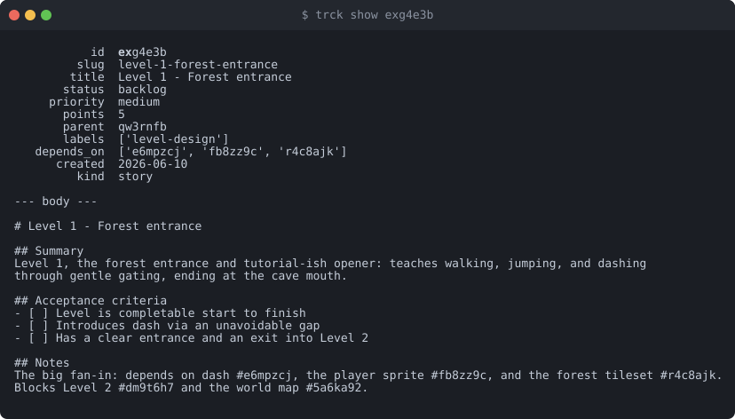

# trck

A deterministic issue tracker that lives *inside* your repo. Every issue is a markdown file
in `items/`; all metadata — status included — lives in `index.jsonl`; `SUMMARY.md` is
generated; only issue *bodies* are hand-authored — so the tracker can't drift.

- **One self-contained binary.** No runtime, no package tree, nothing to install alongside it
  but `git` — a single executable your repo can depend on for years.
- **Git-friendly & agent-friendly.** Plain text, line-oriented `index.jsonl`, generated
  `SUMMARY.md`, and a hand-edited markdown body per issue. Merge drivers resolve concurrent
  edits row by row instead of leaving conflict markers in your metadata.
- **Zero configuration.** The vocabulary is fixed — four statuses, five priorities, three
  resolutions — so every tracker means the same thing. Anything finer is a label or a
  custom field.

<p align="center">
  <br>
  <sub><code>trck ready</code> against the bundled <a href="examples/">example tracker</a></sub>
</p>

## Install

```bash
curl -fsSL https://raw.githubusercontent.com/leonkacowicz/trck/main/scripts/install.sh | sh
```

The script picks the right build from `uname`, verifies the published checksum, and installs
to the first writable directory it finds (`~/.local/bin`, `/usr/local/bin`, `~/bin`).
`TRCK_BIN_DIR` overrides where it lands and `TRCK_VERSION` pins which release to fetch.

Prebuilt for Linux (glibc and musl), macOS and Windows, on x86-64 and arm64 — every release
attaches the archives and their `.sha256` files, so downloading one by hand and putting it on
your `PATH` works just as well. There is a Homebrew formula under `packaging/homebrew/`.

On Windows, run the script from Git Bash, or download the `.zip` from the
[latest release](https://github.com/leonkacowicz/trck/releases/latest), extract `trck.exe`,
and add its folder to `PATH`.

Then, in any repo:

```bash
trck init                       # scaffold ./issues (config + the docs that explain it)
                                # `trck init <dir>` puts it somewhere else
trck new "Fix login bug" --priority high   # prints the new issue's file path
trck start k3m                  # any unambiguous prefix works (git-style)
trck review k3m https://github.com/you/repo/pull/12   # -> in-review, and links the PR
trck done k3m9x2a --resolution wontfix
trck list                       # nested forest of active work (settled subtrees hidden)
trck list --all                 # include settled (done) work too
trck list --flat                # flat, globally-sorted list
trck tree k3m                   # alias for `list k3m`: root the forest at one issue's subtree
```

`trck` finds its tracker by walking up from your current directory to the folder containing
`trck.json`, so it works from anywhere in the repo. Override with `--dir PATH` or `$TRCK_DIR`.

## Keeping a tracker honest

```bash
trck check          # nonzero exit if the tracker is inconsistent
```

That is the command worth wiring into CI: it catches an index row with no body file, a
dangling parent, a dependency cycle — anything that would make the tracker disagree with
itself. Install a step that runs it on every push, pinned to a version so your build does
not change behaviour because a release happened overnight.

Locally, `trck repo install-hook` adds a pre-commit hook that runs the same check whenever a
commit touches the tracker. Treat it as a convenience rather than a guarantee: a hook is one
`--no-verify` away from silent, and it does nothing at all on a machine that has no `trck`.

## Moving a tracker onto a branch

A tracker is either a directory in your working tree or **the root of a git ref**. The branch
shape keeps issue churn off your code branches: nothing is checked out, reads come out of the
object store, and a write verb builds a commit and pushes it by itself — whatever branch you
are on, however dirty your tree is.

Converting an existing `issues/` directory is one git command. Split its history onto an orphan
branch named `trck-issues`, which is the name every verb looks for:

```bash
git subtree split -P issues -b trck-issues   # issues/'s whole history, rewritten to the root
git push origin trck-issues
```

`-P` rewrites the prefix away, and that is the point: the branch's *root* is the tracker, so
`<ref>:index.jsonl` resolves without one. History is preserved commit for commit, so `trck diff`
over pre-migration revisions keeps working.

Check the result by object id rather than by diff:

```bash
git rev-parse HEAD:issues trck-issues^{tree}   # must print the same oid twice
trck --ref trck-issues check
```

Two equal tree oids mean index, bodies, summary, `.gitattributes` and `trck.json` are identical
by construction — there is no file a comparison could have skipped.

**Publishing the branch changes nothing on its own.** Discovery goes `--dir` → `$TRCK_DIR` →
`--ref` → `$TRCK_REF` → the walk-up for `trck.json` → the conventional `trck-issues` ref (the
local branch, else `origin/trck-issues`), so a directory in the working tree still wins and every
clone keeps behaving as it did. The move is the *separate* commit that deletes `issues/` — which
is what makes it reviewable and revertible on its own. Until it lands, every write still goes to
the directory and the branch drifts from the moment you cut it, so re-run the split against the
tree as it stands when you flip rather than pushing what you split earlier.

Before flipping:

- **Check the tracker never lived under another path.** `-P issues` only sees history beneath
  that prefix; an earlier incarnation somewhere else is dropped without a word. Read the renames
  in its history before trusting the split.
- **Everyone needs `trck` v0.30.0 or newer.** No binary published before that can read a ref: an
  older one looks for a directory, does not find one, and says so.
- **A shallow or single-branch clone does not fetch the branch**, so the tracker reads as absent
  there — the usual case being a CI checkout. Adding
  `+refs/heads/trck-issues:refs/remotes/origin/trck-issues` to `remote.origin.fetch` fixes it,
  and `trck` says as much when it detects that shape.
- **A `trck check` step on your code branches stops seeing the tracker.** Give the tracker branch
  its own CI, triggered by pushes to it. On GitHub that workflow has to live *on that branch*: a
  `push:` trigger is resolved from the ref the push happened on, so the same file kept on your
  default branch never fires at all.

## Upgrading

Whatever installed `trck` owns the file: re-run the install script, or use your package
manager. There is deliberately no self-update — a binary that rewrites itself while a package
manager believes it owns that path is a worse problem than the one it solves. `trck version`
reports what you have, and there is no `update` verb: typing one gets an error naming the
upgrade path instead.

## Vocabulary

The vocabulary is **fixed** — not configured, not renameable, not extensible. These are
decisions worth making once rather than per repo, and fixing them is what lets any tool
reading a tracker know what it is looking at without first reading a config file.

### Statuses

    backlog  →  in-progress  →  in-review  →  done

| status | means | to the engine |
|---|---|---|
| `backlog` | not started | where `trck new` lands an issue; the first move off it stamps `started` |
| `in-progress` | someone is on it | claimed, so `ready`/`next` skip it — but it still **blocks** its dependents. What a partly-finished parent rolls up to |
| `in-review` | in flight, output pending someone else's judgement | nothing to pick up, so `ready`/`next` skip it — but it still **blocks** its dependents |
| `done` | finished | satisfies a dependency; counts toward progress. Entering it stamps `closed`; leaving it (reopen) clears that and any resolution |

Status is stored in `index.jsonl` and nowhere else — moving an issue rewrites one index line
and leaves its body file where it is.

`in-review` is the one that needs a rule, because it looks like it overlaps `depends_on`:

- **`depends_on`** when the blocker is real work someone will do and close.
- **`in-review`** when making it a task would be inventing one.

A code review forces the distinction: the reviewer isn't producing a deliverable, they're
judging yours, so a task for it would be a fiction — and one per reviewable issue would
double the tracker. Same for a vendor reply or a sign-off nobody here will ever close.

A **parent's status is derived from its children**: all `backlog` → `backlog`, all `done` →
`done`, otherwise `in-progress`. The rollup is maintained on every move, recursively up to the
root. To override it, `mv` the parent by hand — that pins its status; `set NNN --auto`
returns it to derivation.

`trck mv NNN <status>` moves between any two; `start` / `review` / `done` are aliases for the
three you reach for.

### Priorities

    urgent  >  high  >  medium  >  low  >  lowest

Ordered by precedence, and that order drives `list --sort priority` as well as the demand
ranking behind `ready` and `next` (which weighs what an issue *unblocks*, not only what it
declares — see **Ranked by demand** under [Common verbs](#common-verbs)). `trck new` assigns
`medium` when you don't pass `--priority`.

### Resolutions

    superseded  ·  wontfix  ·  duplicate

Valid only on `done`, and they all mean **closed without shipping**: a later issue took over,
nobody will do it, or it's already tracked elsewhere. The normal case is to carry *none* —
"finished, it went out" — and that absence is load-bearing: `trck changelog` lists issues
closed in a window **without** a resolution, so there is deliberately no `fixed`.

### Anything finer

A distinction the four statuses don't draw — `qa` versus `awaiting-deploy`, a bug/story
split, a team — is a **label** (multi-valued, free text) or a **custom field** (one value per
key). Both filter and sort, so a second status vocabulary would only overlap them.

## Configuration (`issues/trck.json`)

With the vocabulary fixed, `trck.json` holds the format version and the update channel. It
exists mainly to mark the tracker's root:

```json
{
  "format": 1,
  "update": { "repo": "leonkacowicz/trck", "channel": "stable" }
}
```

The `update` block only records where the binary came from — no verb acts on it, since
upgrading is the job of whatever installed the file.

`format` says which shape the tracker is written in: an engine refuses a tracker newer than it
understands, and reads every older one. When to bump it, the extension mechanism, the older
shapes still read, and the `TRCK_NOW` clock override are in
[docs/tracker-format.md](docs/tracker-format.md).

## Machine-readable output (`--json`)

`list`, `show`, `deps`, `ready` and `next` take `--json`. Every one emits **exactly one
JSON document** — `json.loads(stdout)` is always the way to consume it — and issue objects
are the same shape everywhere: every stored field, `null` where unset, ids never abbreviated.

```bash
trck list --json                  # nested forest: each node + a "children" array
trck list --flat --json           # flat array, in the sorted order
trck show NNN --json              # the metadata plus a "body" field
trck deps NNN --json              # {"requires": [...], "blocks": [...]}
trck next --json                  # {"in_flight": [...], "ready": [one row]}
```

Three shape notes worth knowing:

- **`list --json` marks context rows.** The forest pulls non-matching ancestors in so a
  matched child never floats free; the human view dims them, and the JSON sets
  `"context": true`. Without it you can't tell a result from the scaffolding.
- **`ready`/`next --json` are an object, not an array.** `{"in_flight": [...], "ready":
  [...]}` — the ranked pick list beside the leaves somebody has already started, as whole
  rows. Both verbs emit the same shape; `next` differs only in that `ready` holds at most
  one row. The document always carries `in_flight`, even though the human view prints it
  only above the one-pick view: a caller that doesn't want the context can ignore a key,
  while one that does can't invent it.
- **`ready`/`next --json` carry the demand note as data.** A row lifted above its own
  priority gets `demand_priority` and `demand_source` — what the human view renders as
  `↑urgent(#a1b2c3)` — omitted on rows that aren't lifted. **The `ready` order is the
  contract**: this verb's whole answer is "in what order", so you never re-derive it.

An empty result is `[]` — or, for `ready`/`next`, an object of empty arrays — not silence.

## The browser view (`trck html`)

```bash
trck html                          # writes <tracker>/issues.html
trck html --out docs/issues.html   # or wherever you want it
```

**One self-contained file.** The stylesheet, the script and the whole tracker are inlined, so
the page references nothing external — no CDN, no webfont, no fetch. It opens over `file://`,
survives being mailed around, and works as a CI artifact with nothing to serve.

Five views over the same data, switched from the top bar:

| view | what it is |
|---|---|
| `list` | every issue, flat, priority-ordered |
| `graph` | the dependency DAG as a layered SVG, with `deps`' own done-chain toggles |
| `tree` | the nested forest, collapsible parent by parent |
| `board` | a column per status — plus a **`ready`** column right after the first one |
| `ready` | the ranked pick list, in exactly `trck ready`'s order |

A search box matches on id, title, body text and labels at once; status and priority facet
boxes narrow whichever views they mean something for. Every box starts checked, so the bar
states what is on screen rather than sitting empty beside an unfiltered list, and narrowing is
always an unchecking. The board and `ready` opt out — a board already lays issues out *by*
status, so filtering by it would blank columns instead of narrowing anything — and the
selection is kept rather than cleared, so a trip through them leaves the list's filter as it
was. In the graph a filter isn't a subtraction: it *seeds* the drawing with the union of the
matches' dependency cones, so a match arrives with what it waits on and what waits on it.

The board's `ready` column is derived, not a status, and nothing is ever moved into it: a ready
issue is an unblocked leaf nobody has started, which makes it a strict subset of `backlog`. It
takes cards from that one column and no other, so every card still sits in exactly one place
and `backlog` reads as "not yet" rather than as a bag holding both.

Selecting a row opens it beside the view: metadata, its labels and rollup `%`, links you can
click through to its parent, children, blockers and dependents, its `review_url` as a real
anchor, and its markdown body rendered (with a toggle back to raw).

**The engine computes, the page renders.** Readiness, the demand cone and its `↑priority`
marker, rollup percentages, the shortest-unique-id prefix — all of it is written into the data
island by the binary, and the script re-derives none of it. The page and the CLI cannot
disagree about what the tracker says.

**Edits stage; they never save.** A page opened from disk has nothing to write to, and one that
pretended otherwise would lose work silently. So changing a status or priority queues the
`trck` command that *would* do it, and a bar at the bottom hands you the lot to paste into a
terminal. The tracker is still only ever written by the binary.

### The same page, live (`trck serve`)

```bash
trck serve                         # http://127.0.0.1:8725/
trck serve --port 0                # let the OS pick; the startup line says which
trck serve --poll 5                # fetch the tracker branch every 5s (0 turns it off)
```

`html` writes a file, which is a tracker frozen at the moment you remembered to regenerate it.
`serve` renders the same page per request, so a reload shows the tracker as it is now —
including a write another terminal made a second ago.

**It is the one thing in trck that fetches without being asked.** Every read verb leaves the
network alone, so a `trck list` on a plane answers instead of failing; `serve` is a long-lived
process with a timer rather than a verb in a pipeline, so it pays that round trip once per
interval however many pages are open — and what it buys is the whole point, since a tab left
open on a week-old ref is a read from the past with nothing to say so. It applies the same
local-versus-remote rule everything else does: behind fast-forwards, ahead or equal does
nothing, **diverged is reported and never resolved**. An unreachable remote is reported too,
and the local ref is served anyway; the process does not die because a laptop left the office.
The running log goes to stderr, and only when something changes.

**Loopback only, and there is no flag that widens it.** A tracker is a repository's working
notes; nothing here should be reachable from a network. A request naming a host that is not
this machine's own is refused, so a page on the open web cannot use your browser to read your
tracker. `/app.css` and `/app.js` answer from the copies compiled into the binary, never from a
file on disk. Ctrl-C stops it and frees the port.

It **serves**; it does not write. Edits still stage into commands to paste, exactly as they do
from a file — the tracker is only ever written by a verb you ran.

## Issue ids

Each issue gets a **short random alphanumeric id** — 7 characters drawn from a base32
alphabet with look-alike characters (`0/1/o/l/i`) removed, e.g. `k3m9x2a`. Random ids
make concurrent `trck new` on two branches collision-free.

Wherever a command takes an id, **any unambiguous prefix works** (git-short-hash style):
`trck show k3m` resolves to `k3m9x2a` as long as no other id starts with `k3m`. An
ambiguous prefix is an error that lists all matching candidates.

### Supplying an id

`trck new --id k3m9x2a` uses the id you give instead of minting one. It's for moving issues
in from another tracker with their ids intact, restoring one deleted by hand, and scripted
seeding — the id must be unused (in the index *and* on disk) and well formed, so it can't
reintroduce the collisions random ids exist to prevent.

There's no equivalent on `set`: changing an existing issue's id would have to rewrite every
`parent`/`depends_on` pointing at it and rename its body file.

## Common verbs

`new` · `mv` · `start` · `review` · `done` · `set` · `dep` · `label` · `show` · `list` · `ready` ·
`next` · `tree` · `deps` · `path` · `which` · `changelog` · `diff` · `check` · `summary` ·
[`html`](#the-browser-view-trck-html) · `init` · `version`, plus `repo normalize` · `repo install-hook` · `repo setup-git` ·
`repo migrate-layout` for tracker maintenance. Run `trck --help` (or `trck <verb> --help`)
for details.

`list` is the structure-aware browse verb. By default it prints a **nested forest** — each
issue, with children nested under their parent. Siblings are ordered **topologically**: a
blocker sits above what it blocks, the same order `deps` draws, with `--sort` (default
`created`) deciding between rows no dependency separates. The rank is computed over the whole
graph, so a constraint routed through another epic still orders two siblings that name each
other nowhere, and filtering rows out never reshuffles the ones that remain. A **done**
dependency constrains nothing — the same rule that clears a row's `needs #NNN` note — so a
tracker with no open dependencies comes out in plain `--sort` order.
Each row opens with a **gutter glyph**, single-width so the ids line up:

| glyph | means |
|---|---|
| `◇` | **ready** — an unblocked leaf nobody has started. What `trck ready` would list |
| `○` | `backlog`, but not ready: waiting on a dependency, or an epic |
| `◐` | `in-progress` or `in-review` — started, and somebody's |
| `●` | `done` |

`◇` is deliberately outside the `○◐●` fill gauge: that gauge says how far along the work is,
and readiness is not a point on it. So a dense `list` answers "what could I pick up" without a
second command.

By default it also **hides settled work**: a terminal (done) issue is shown only while it is
still open or sits directly under a non-terminal parent — so an open epic keeps its done
children as progress context, but a fully-done subtree and standalone done tasks drop off.
`--all` shows everything; an explicit `--status` bypasses the prune (e.g. `--status done`
lists every done issue). `--flat` gives a flat, globally-sorted list instead; a positional id
(`trck list k3m`) roots the forest at that issue's subtree. Filters (`--status`, `--priority`,
`--label`, `--field`, `--match`, `--parent`, `--blocked`, `--orphan`) select the matches and
the forest fills in their **ancestor spine** as dimmed context, so a matched child never floats
away from its parent. `tree` is an alias for `list` (`trck tree k3m` == `trck list k3m`).

<p align="center">
  <br>
  <sub><code>trck tree</code> — the active forest; done items show as context under open epics (settled subtrees are hidden; <code>--all</code> shows them)</sub>
</p>

`ready` lists the **unclaimed** issues whose dependencies are all satisfied (add `--next` for
just the top pick); `next` prints the single best issue to work on next. Ready means
`backlog` — a leaf nobody has started, blocked by nothing. A started issue is somebody's, and
handing it to the next person who asks is the collision these verbs exist to prevent; it is
still listed, still blocks its dependents, still counts toward the ranking below, and `next`
names it (see the in-flight line). Both take an optional issue id —
`trck ready NNN` scopes to that issue's subtree, answering "what can I pick up on this epic
right now".
Scoping narrows the answer, never the constraints: a leaf waiting on something outside the
subtree, directly or through an edge authored on an ancestor, stays out of the list — and
never the ranking either: rows are ranked over the whole graph, then filtered.

**`next` names what is taken before it names what to take.** Above the single pick sits an
`in flight:` line listing the leaves somebody has already started — `in-progress` or `in-review`.
There is no assignee field, so `start` is the only claim a tracker records, and this is where
you read it: an idle picker sees what a colleague holds without being offered it, and comes
back to their own in-progress work without it competing for the top slot. Nothing started, no
line. Scoping to a subtree scopes the line too. The full `ready` list carries no such line —
it already renders every row the line would name.

**Ranked by demand.** `ready`/`next` don't order by an issue's own priority alone — a
medium task standing between you and an urgent one matters more than a high one that
blocks nothing. Each issue is ranked by its **demand cone**: itself plus every unfinished
issue transitively waiting on it, through both authored dependencies (a dependent needs
it) and containment (a parent isn't done until its children are). The cone's members are
counted per priority and compared highest-first, so the cone's top priority decides, and
within it blocking *two* high issues beats blocking one. Levels never trade — no pile of
mediums adds up to a high — and `-points`, then id, break what's left. Finished issues
neither count nor conduct: an urgent dependent closed as `wontfix` stops making its
blockers urgent, exactly as it stops blocking them.

A row that ranks above its own priority says why, naming the issue that drives it:

    ◇ #k3m9x2a backlog  medium  Extract the parser  ↑urgent(#a1b2c3)

Nothing about this is stored — it's derived from the graph on every run, like readiness
itself. `list --sort priority` still sorts the declared field, and so does `SUMMARY.md`.

Epics: attach children with `--parent NNN` and the parent *becomes* an epic — there is
nothing to declare, since having children is the whole of what an epic is. Its
points-weighted rollup `%` is computed from those children and shown after the title on
every parent row in `trck list`/`tree` (leaf rows carry none) as well as in `SUMMARY.md`.
Filter a list to one epic's children with `trck list --parent NNN`.

**Review links** — `in-review` means the output is waiting on someone else's judgement,
and `review_url` records *where*. `trck review NNN <url>` moves the issue and links it in
one move:

    trck review k3m https://github.com/you/repo/pull/12   # -> in-review, linked
    trck new "Fix login" --review-url https://…/pull/9    # or set it at creation
    trck set k3m --review-url https://…/pull/13           # relink; `none` clears it
    trck mv k3m in-progress --review-url https://…/pull/13    # or record it on any move
    trck list --show-field review_url                     # show it as a column

The value must be an absolute `http(s)` URL (`check` enforces it) but is otherwise
forge-agnostic — trck never talks to GitHub, and the URL need not be a pull request at all
(a design doc out for comment, a vendor ticket, a sign-off thread). It shows in `trck show`,
links from `SUMMARY.md`, and renders as a clickable anchor in the HTML view. An issue in
`in-review` drops out of `ready`/`next` while it waits — there is nothing there to pick up —
yet still blocks its dependents until it's `done`.

Labels: tag issues with a flat, multi-valued set of free-text labels via
`trck label NNN --add X --remove Y`, then filter with `trck list --label X`. Labels show
up in `show`, `list`, `tree`, and `SUMMARY.md`.

**Custom fields** — attach arbitrary `key=value` metadata that trck doesn't model itself:
`assignee`, `reporter`, `component`, `area` — whatever a project needs. They're **free-form**
(no `trck.json` declaration) and always string-valued, so they stay out of the core mental
model until you reach for them. Set them on `set`, then **filter**, **sort**, and **show**
them on `list`:

    trck set k3m --field assignee=alice --field component=engine  # set (repeatable)
    trck set k3m --field assignee=                                # clear (same as --unset assignee)
    trck list --field component=engine                            # filter: exact, AND-ed, composes with --status etc.
    trck list --field component=engine --sort field:assignee      # sort by a field (rows missing it sort last)
    trck list --show-field assignee --show-field component        # opt-in trailing columns

Keys must be slug-like (`[a-z][a-z0-9_-]*`) and can't shadow a built-in field. Values always
appear in `trck show`; `list` stays clean unless you ask for a `--show-field` column. `check`
flags any malformed key or non-string value. Free-form by design — a future opt-in schema
(types, allowed values, required-ness) is sketched in
`docs/specs/2026-06-11-custom-fields-design.md`.

**Full-text body search** — `trck list --contains TEXT` keeps the issues whose markdown body
holds `TEXT`, matched case-insensitively as a literal substring. Not a regex, and not a verb
of its own: it is a **filter**, so it composes with everything else `list` takes and renders
through every output mode.

    trck list --contains 'race condition'                          # the nested forest, filtered
    trck list --contains 'race condition' --status '!done'         # AND-ed with any other filter
    trck list --contains 'race condition' --json                   # ...or as one JSON document

The body opens with its own `# Title` heading, so `--contains` finds everything `--match`
would and more; `--match` stays for when you mean the title alone.

It answers identically whether the tracker is a directory or a git ref, which is why it is a
filter rather than a pipeline. The old recipe — `rg -l TEXT $(trck list --paths) | trck which`
— cannot work against a ref-backed tracker, because there are no files on disk for `rg` to
open and no paths for `which` to map back. `--contains` searches the blobs directly, with one
`git grep` per invocation rather than one read per issue. `path`, `which` and `list --paths`
are still there for a working-tree tracker, and still refuse a ref-backed one rather than
printing a path that is not there.

Output is colorized when stdout is a terminal (disable with `NO_COLOR=1`, force with
`FORCE_COLOR=1`); piped/redirected output stays plain for scripts and agents. `trck show`
prints a human-readable summary by default — add `--json` for machine-readable metadata.

<p align="center">
  <br>
  <sub><code>trck show exg4e3b</code> — one issue's metadata above its hand-authored body</sub>
</p>

## Recommended usage

trck gives you four ways to relate issues — **parent/child**, **labels**, **dependencies**,
and **priorities**. They mean different things; using the right one keeps the tracker honest.

### Parent / child = decomposition, not categorization

Make one issue the **child** of another only when the children are a genuine **break-down of
the parent into sub-tasks** — the parent *is* the sum of its children.

- A parent is **not** a generic bucket of similar tasks. For grouping similar work, use
  **labels** instead.
- A parent should be a **single, clear, achievable goal** that you split into the steps
  needed to reach it.
- **Litmus test:** the parent can be marked *done* exactly when all its children are done. If
  finishing the children wouldn't justify closing the parent, it isn't a parent — it's a label.
- Children are **unordered.** A parent expresses *what* it decomposes into, not *when* each part
  happens. If sub-tasks must be done in sequence, encode that with **dependencies** (chain them:
  the second depends on the first, the third on the second, …) — never rely on their listed order.

### Dependencies = hard ordering (MUST)

A **dependency** encodes that one task *must* be completed before another can be:
`A depends on B` means **B blocks A**. It's a real constraint — `trck ready` and `trck next`
will not surface a task until its dependencies are satisfied. `trck list` makes the graph
visible inline: each row carries a dim `needs #NNN` for every open (non-terminal) blocker and
`blocks #NNN` for the issues waiting on it; both clear automatically once the blocker is done.
`trck deps` draws the dependency DAG as a lazygit-style gutter, topologically sorted so a
blocker always sits above what it blocks — the whole graph with no id, or `trck deps NNN`
for just that issue's directed dependency line (its transitive prerequisites and
dependents), where the focal issue's row is marked with a `▸` and bolded. Scope to one
cone with `trck deps NNN --requires` (only what it needs) or
`--blocks` (only what waits on it); add `--full` instead to widen to the issue's whole
connected cluster, including cousins joined only through a shared neighbour.

The graph shows more than the edges you typed — parent/child containment is drawn as an
inferred edge, inherited edges surface where their ancestor is off screen, redundant edges are
reduced away, and done chains are hidden by default. All of it is display-only; only
`trck dep --add/--remove` changes what is stored. The rules are in
[docs/dependency-graph.md](docs/dependency-graph.md).

<p align="center">
  <br>
  <sub><code>trck deps</code> — the dependency DAG, each lane traced in its own colour</sub>
</p>

#### Dependencies climb the parent hierarchy

Dependencies compose with containment, so a single authored edge covers a whole subtree on
both ends — you never restate it on each child. `ready`/`next` and the inline `needs #NNN`
annotations honour these **effective** dependencies, not just the edges you typed. The mirror
`blocks #NNN` note stays at the altitude the edge was authored — it names the issues that
declared the dependency, and the subtrees under them inherit the wait.

- **Depending on a parent depends on its whole subtree.** Because a parent is *done* only when
  all its descendants are (status rolls up), `A depends on P` means A waits for every issue
  under `P`, recursively — not just `P` itself.
- **A parent's dependencies are inherited by its children.** If `P depends on B`, then every
  issue under `P` is effectively blocked by `B` too: none of `P`'s work can start until `B` is
  done. A row blocked this way says `needs #B (via #P)` — naming the issue the edge is actually
  authored on, which is where you'd `trck dep #P --remove #B`. The tag is spelled out only where
  `P`'s own row isn't on screen (`--flat` with a filter, or a forest rooted below `P`); in the
  usual nested view `P` sits right above its children already saying `needs #B`, so the
  children stay quiet rather than repeating it.
- **An issue and its own ancestor or descendant can never depend on each other** — that would
  be a cycle (a child would wait for its parent, but the parent isn't done until the child is).
  Siblings and cousins may depend on each other freely. Any edge that would close such a cycle,
  directly or through the hierarchy, is rejected when you add it, and `trck check` flags one
  that slips in via a hand-edit.

**Put the arrow at the right altitude — be precise about who depends on what:**

- If a parent **as a whole** can't proceed until another issue is done, put the edge on the
  **parent**; every child inherits it automatically.
- If **only specific children** need it, put the edge on **those children**, not the parent, so
  you don't needlessly block their siblings.
- On the depended-on side, likewise: depend on the **specific issue** you actually need — reach
  for its parent only when you genuinely need the whole subtree done first.

Precise edges keep `ready`/`next` honest: an over-broad dependency hides work that is actually
actionable, and a missing one surfaces work that isn't.

### Priorities = soft ordering (SHOULD)

A **priority** expresses that a task *should* be done before another — an ordering
preference, not a constraint. Nothing is blocked; it just influences what to pick up next.

Set it on the issue that *carries* the urgency, not on everything it needs. `ready`/`next`
propagate it backwards for you: an issue inherits the urgency of whatever waits on it (see
**Ranked by demand** under [Common verbs](#common-verbs)), so marking every prerequisite
urgent by hand only flattens the ordering you were trying to express.

> Rule of thumb: decomposition → **parent/child**; "a category of similar things" →
> **labels**; "must come first" → **dependency**; "ought to come first" → **priority**.

## Develop

`cargo build --release`. The engine is `src/` — one package at the repo root, no workspace,
and no dependencies. Build, tests, the quality ratchet and the release process are in
[CONTRIBUTING.md](CONTRIBUTING.md). This repo **self-hosts** its own issues — browse
[the tracker](../../blob/trck-issues/SUMMARY.md) to see `trck` tracking its own roadmap.

They are not in this tree. They live at the root of the
[`trck-issues`](../../tree/trck-issues) branch, which is the other shape a tracker can take: a
git ref instead of a directory, read out of the object store with nothing checked out. Every verb
finds it with no flags, and a write verb commits and pushes there by itself, whatever branch you
happen to be on. `trck --ref <rev>` or `$TRCK_REF` points at a different one; a tracker directory
in the working tree still wins when there is one, which is what let this repository move over in
pieces — see [Moving a tracker onto a branch](#moving-a-tracker-onto-a-branch) for the split that
does it.
